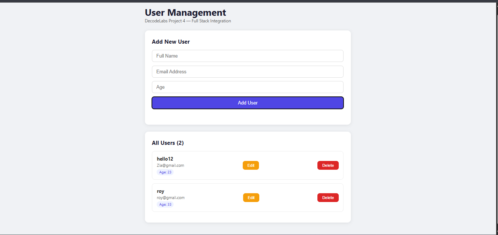
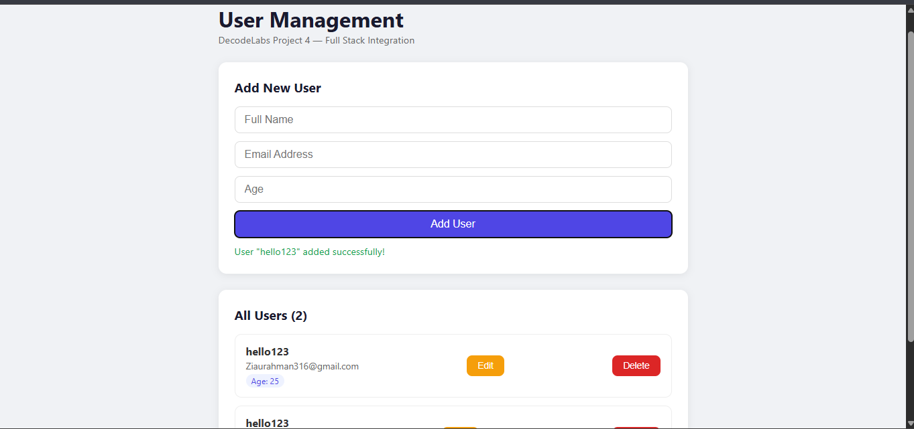
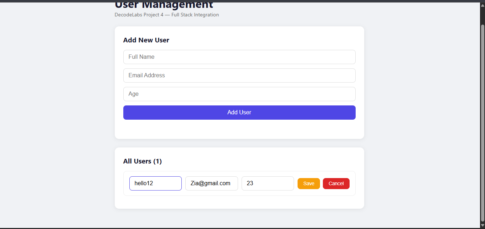
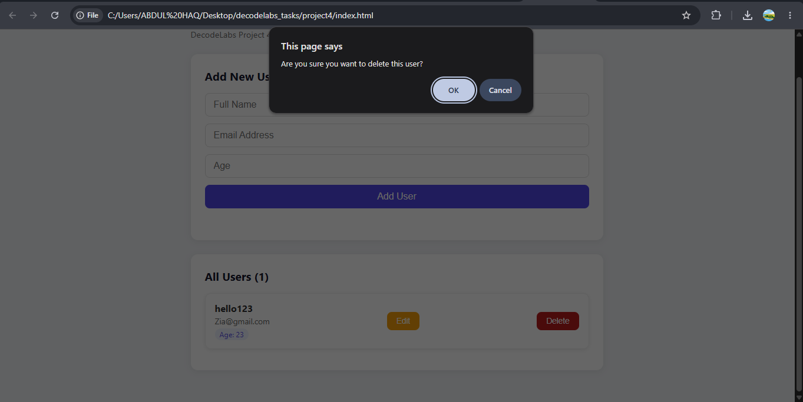

# 🚀 DecodeLabs Full Stack Internship — Batch 2026

> A progressive series of full-stack projects demonstrating mastery of REST API design, database integration, and frontend-backend communication.

---

## 👨‍💻 Student Information

| Field | Detail |
|-------|--------|
| **Name** | Abdul Haq |
| **GitHub** | [TheHaqHub](https://github.com/TheHaqHub) |
| **Program** | DecodeLabs Full Stack Internship — Batch 2026 |
| **Stack** | Node.js · Express · SQLite · HTML · CSS · JavaScript |

---

## 📁 Repository Structure

```
decodelabs_tasks/
│
├── project2/              # REST API with in-memory storage
│   ├── index.js
│   └── package.json
│
├── project3/              # REST API with SQLite persistence
│   ├── database/
│   │   └── db.js
│   ├── middleware/
│   │   └── validate.js
│   ├── routes/
│   │   └── users.js
│   ├── server.js
│   └── package.json
│
├── project4/              # Full-Stack Frontend + Backend Integration
│   ├── index.html
│   ├── style.css
│   └── README.md
│
└── README.md
```

---

## 📌 Project 2 — User Management REST API

> **Goal:** Build a fully functional REST API using Node.js and Express with in-memory data storage.

### ✅ Features
- Full CRUD operations (Create, Read, Update, Delete)
- Input validation with meaningful error messages
- Proper HTTP status codes (200, 201, 400, 404, 409)
- In-memory user storage (array-based)

### 🛠 Tech Stack
`Node.js` `Express.js`

### 🚀 How to Run

```bash
cd project2
npm install
node index.js
```

Server runs on: `http://localhost:3000`

### 📡 API Endpoints

| Method | Endpoint | Description |
|--------|----------|-------------|
| GET | `/users` | Get all users |
| GET | `/users/:id` | Get user by ID |
| POST | `/users` | Create new user |
| PUT | `/users/:id` | Update user |
| DELETE | `/users/:id` | Delete user |

### 📥 Request Body (POST / PUT)

```json
{
  "name": "Abdul Haq",
  "email": "abdul@example.com",
  "age": 22
}
```

---

## 📌 Project 3 — User Management API with SQLite

> **Goal:** Upgrade Project 2 with a real database — replacing volatile in-memory storage with persistent SQLite.

### ✅ Features
- Persistent SQLite database (data survives server restarts)
- Modular architecture (routes / middleware / database layers)
- Two-layer input validation middleware (syntactic + semantic)
- Duplicate email detection with `409 Conflict`
- Auto-incrementing IDs via SQLite

### 🛠 Tech Stack
`Node.js` `Express.js` `SQLite (sql.js)` 

### 🚀 How to Run

```bash
cd project3
npm install
npm start
```

Server runs on: `http://localhost:3000`

### 📡 API Endpoints

| Method | Endpoint | Description |
|--------|----------|-------------|
| GET | `/users` | Get all users |
| GET | `/users/:id` | Get user by ID |
| POST | `/users` | Create new user |
| PUT | `/users/:id` | Update user |
| DELETE | `/users/:id` | Delete user |

### 📥 Request Body (POST / PUT)

```json
{
  "name": "Abdul Haq",
  "email": "abdul@example.com",
  "age": 22
}
```

### 🏗 Architecture

```
HTTP Request
     ↓
Express Router (routes/users.js)
     ↓
Validation Middleware (middleware/validate.js)
     ↓
SQLite Database (database/db.js)
     ↓
JSON Response
```

### ✔ Validation Rules

| Field | Rules |
|-------|-------|
| `name` | Required, non-empty string |
| `email` | Required, must contain `@` and `.` |
| `age` | Required, number between 0–120 |

---

## 📌 Project 4 — Frontend & Backend Integration

> **Goal:** Bridge the gap between isolated UI and isolated API — building a complete full-stack web application.

### ✅ Features
- Dynamic user listing fetched from backend API
- Add new users via form with frontend validation
- Edit existing users inline (PUT request)
- Delete users with instant DOM update (no page reload)
- Graceful error handling (`response.ok` check + try/catch)
- CORS-enabled backend for cross-origin requests

### 🛠 Tech Stack
`HTML5` `CSS3` `Vanilla JavaScript` `fetch() API` `async/await`

### 🚀 How to Run

**Step 1 — Start the backend:**
```bash
cd project3
npm start
```

**Step 2 — Open the frontend:**
```
Open project4/index.html in any browser
```

> No build tools, no install — pure frontend.

### 🏗 Full Stack Architecture

```
Browser (project4/index.html)
        ↓  fetch() — async/await
Express REST API (project3 — port 3000)
        ↓  SQL queries
SQLite Database (users.db)
        ↓  JSON response
DOM updated in real-time
```

### 🔄 Data Flow (IPO Model)

| Stage | What Happens |
|-------|-------------|
| **Input** | User fills form → JS reads values |
| **Process** | fetch() sends HTTP request to Express API |
| **Output** | Response parsed → DOM updated dynamically |

---

## 🧰 Full Tech Stack Summary

| Technology | Used In |
|-----------|---------|
| Node.js | Project 2, 3 |
| Express.js | Project 2, 3 |
| SQLite (sql.js) | Project 3, 4 |
| HTML5 / CSS3 | Project 4 |
| Vanilla JS + fetch() | Project 4 |
| async / await | Project 4 |
| REST principles | Project 2, 3, 4 |
| Git + GitHub | All projects |

---

## 🧠 Design Decisions

- Used `sql.js` instead of `better-sqlite3` to avoid native C++ compilation issues on Windows — pure JavaScript SQLite with identical SQL syntax
- Separated routes, middleware, and database layers for scalability
- Used native `fetch()` API instead of Axios to demonstrate core JS understanding
- CORS enabled on backend to support file-based frontend development

---


## ⚙️ Configuration

No environment variables required for Project 2 or 4.  
Project 3 uses a local SQLite database file (`users.db`) auto-created on first run.

---

## 🚧 Future Improvements

- Add JWT authentication
- Add pagination for large user lists
- Deploy backend to Render or Railway
- Add input sanitization library (e.g. DOMPurify)
- Add unit tests with Jest

---

## 🎯 Key Learning Outcomes

- Designed and implemented RESTful APIs following industry conventions
- Migrated from volatile in-memory storage to persistent SQL database
- Applied layered input validation (syntactic + semantic)
- Integrated frontend with backend using the native `fetch()` API
- Handled asynchronous operations cleanly using `async/await`
- Understood and resolved real-world issues (CORS, native modules, HTTP status codes)
- Maintained clean Git history with structured commits

---

## 📬 Contact

**Abdul Haq**  
GitHub: [TheHaqHub](https://github.com/TheHaqHub/decodelabs_tasks-)  
Program: DecodeLabs Full Stack Internship · Batch 2026

---


## 📸 Screenshots (Project 4)

### Home Page


### Add User


### Edit User


### Delete User


